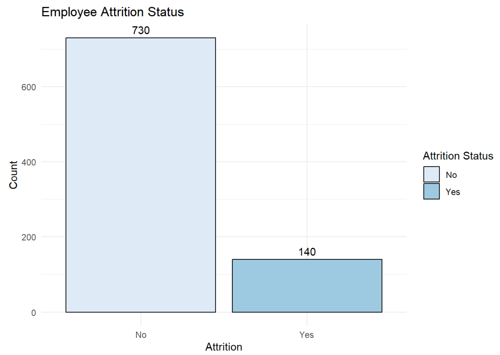

# Attrition Project by Megan Huy
# Executive Summary

## Overview
The goal of this study was to investigate the factors contributing to employee attrition within the Frito Lay Company. By analyzing various employee attributes, the study aimed to develop a predictive model that identifies employees at risk of leaving, providing insights to improve retention strategies.

The analysis allows our stakeholders to find meaningful insight of attrition to help retain employees. This could improve employee satisfaction, employee growth, reduce burnout, and reduce cost or time to train new hires.

## Significant Factors Related to Attrition
Through exploratory data analysis and feature selection, the study identified the following factors as significantly related to attrition:
### Over Time

  

### Percent Salary Hike

  

### Years at Company

  
  
  

### Monthly Income

  

These factors were found to be the most predictive of whether an employee would stay or leave.

## Model Performance
The Naive Bayes and k-Nearest Neighbors (k-NN) models were tested for predicting attrition. The Naive Bayes model was chosen as the final model, achieving a sensitivity of 65% and a specificity of 62% on the validation set. These metrics meet the required minimum for identifying at-risk employees while minimizing false positives.

## Additional Inference
Employees that had low monthly income and worked overtime were more likely to leave, particularly in Sales and Research & Development. Most employees that left Human Resources worked for less than five years.
